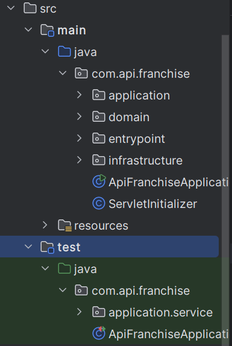
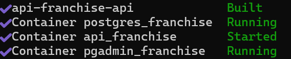

# 🏪 API Franchise - Backend

Este proyecto es una API desarrollada con **Spring Boot + WebFlux**, diseñada para gestionar información de franquicias | sucursales | productos. Sigue los principios de **arquitectura limpia** y **hexagonal**, lo que permite una estructura escalable, mantenible y desacoplada

---

## 🎯 Propósito

La API permite:

- CRUD Franquicias
- CRUD Sucursales
- CRUD Productos
- Consultar producto que más stock tiene por sucursal para una franquicia puntual.
- permita actualizar el nombre de la franquicia.
- permita actualizar el nombre de la sucursal.
- permita actualizar el nombre del producto


---
## ⚙️ Tecnologías utilizadas

- **Java 17**
- **Spring Boot**
- **Spring WebFlux** (programación reactiva)
- **R2DBC** (Reactive Relational Database Connectivity)
- **PostgreSQL**
- **Arquitectura limpia + hexagonal**
- **Graddle**
- **Docker**

---


## 🧱 Arquitectura

El proyecto está organizado en capas siguiendo arquitectura limpia:



---

## 🚀 Ejecución del proyecto

### 1. Clona el repositorio

```bash
git clone https://github.com/cristiangil28/api_franquicia.git
cd api-franchise

### 2. correr las imágenes de la base de datos y la app

docker compose up -d --build



### 3. lista de endpoints
en la raíz del proyecto hay un archivo llamado endpoints.json el cual puede ser importado en postman para exponerlos

### 4. Ejecutar test

en la raíz del proyecto ejecutar en las terminal el siguiente comando:  ./gradlew test

### 5. URL render
https://api-franquicia.onrender.com/